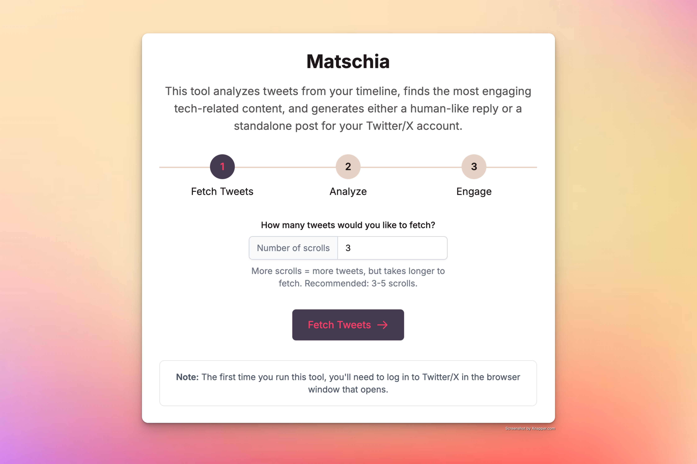

# Matschia - Twitter Engagement Tool

Matschia is a modern web application that analyzes Twitter/X posts, identifies technology-related content, and generates engaging content (replies or standalone posts) in the style of popular tech influencers. It features a clean, shadcn-inspired UI built with Tailwind CSS.

## Overview



_Screenshot of Matschia analyzing and generating content for Twitter/X engagement_

## Features

### Core Functionality

-   **Automated Tweet Collection**: Scrapes your Twitter/X timeline using Playwright
-   **Smart Content Analysis**: Uses OpenAI to classify tweets for tech relevance
-   **Engagement Scoring**: Identifies the most engaging tech-related tweets
-   **AI-Powered Content Generation**: Creates replies and standalone posts in the style of tech influencers like @paulg, @naval, @dhh, and others
-   **Content Editing**: Edit suggested replies and posts before publishing
-   **Direct Posting**: Optionally post replies or standalone tweets directly to Twitter/X
-   **Flexible Engagement**: Choose between replying to tweets or creating new standalone posts

### UI/UX Features

-   **Modern Web Interface**: Clean design with Tailwind CSS
-   **Step-by-Step Flow**: Guided user experience through the analysis process
-   **Visualization**: Engagement scores and tech categories visualized
-   **Responsive Design**: Works on both desktop and mobile devices
-   **Session Management**: Saves session state for faster subsequent runs

## Installation

### Prerequisites

-   Python 3.8 or higher
-   Internet connection
-   Twitter/X account
-   OpenAI API key

### Setup Instructions

1. **Clone the Repository**

    ```bash
    git clone https://github.com/rajnandan1/matschia.git
    cd matschia
    ```

2. **Create and Activate Virtual Environment** (optional but recommended)

    ```bash
    python3 -m venv venv
    source venv/bin/activate  # On Windows: venv\Scripts\activate
    ```

3. **Run the Setup Script**

    ```bash
    python3 setup.py
    ```

4. **Configure Your API Key**
   Create a `.env` file in the project root:

    ```bash
    echo "OPENAI_API_KEY=your_api_key_here" > .env
    ```

5. **Install Playwright Browsers**
    ```bash
    python3 -m playwright install chromium
    ```

## How to Use

### Web Application (Recommended)

1. **Start the Web Server**

    ```bash
    ./run_webapp.sh
    ```

    This will launch the Flask application on http://localhost:5000

2. **Navigate the Web Interface**
    - Enter the number of timeline scrolls (1-10) to determine how many tweets to fetch
    - Follow the step-by-step process through the UI
    - View analysis results and choose between posting a reply or creating a new standalone post
    - Edit the generated content if desired
    - Confirm to publish your content or cancel to start over

### Command-Line Usage (Alternative)

Run the analysis tool directly with:

```bash
./run_twitter_analysis.sh
```

This will:

1. Open a browser window to collect Twitter posts
2. Prompt you to log in to Twitter/X (if this is your first time)
3. Automatically collect tweets from your timeline
4. Analyze the collected tweets for tech relevance
5. Select the most engaging tech tweet
6. Generate a witty reply and a standalone post in the style of tech influencers
7. Save results to `analysis_results.json`

## Project Structure

### Core Components

-   `app.py`: Main Flask web application
-   `tweet_scraper.py`: Handles Twitter scraping with Playwright
-   `twitter_wrapper.py`: API wrapper for Twitter interactions
-   `tweet_poster.py`: Posts replies and standalone tweets to Twitter
-   `twitter_analyzer.py`: Analyzes tweets with AI models
-   `run_webapp.sh`: Script to run the web application
-   `run_twitter_analysis.sh`: Script for standalone analysis

### Data Files

-   `data.json`: Collected raw tweet data
-   `analysis_results.json`: Final analysis output
-   `state.json`: Browser session state for subsequent runs

### UI Components

-   `templates/`: HTML templates for the web interface
-   `static/`: CSS, JavaScript, and image files

## Customization

### Modifying the Analysis Parameters

You can customize the analysis by editing `twitter_analyzer.py`:

-   **Tech Classification**: Update the topics considered technology-related
-   **Engagement Scoring**: Adjust factors that determine engagement potential
-   **Content Style**: Modify the style of generated replies and posts
-   **Post Generator**: Configure the standalone post creation parameters

### Theming

The application uses a custom color scheme defined in CSS variables:

-   Background: #f3e1d5
-   Font color: #1c1716
-   Button background: #453b51
-   Button font color: #f33f66

To change the theme, edit the CSS variables in `static/css/style.css`.

## Development

### Local Development

For local development with hot-reloading:

```bash
export FLASK_APP=app.py
export FLASK_ENV=development
flask run --port=5000
```

### Running Tests

To test just the Twitter API wrapper:

```bash
python3 twitter_wrapper.py
```

## Troubleshooting

### Common Issues

**Q: The application can't connect to Twitter/X**

-   Check your internet connection
-   Verify that your Twitter/X account is not locked or restricted

**Q: No tech tweets are found**

-   Try increasing the scroll count to fetch more tweets
-   Check that your Twitter timeline includes technology-related content

**Q: Content generation fails**

-   Verify your OpenAI API key is valid and has sufficient credits
-   Check the .env file is properly formatted
-   If only post creation fails but replies work, check Twitter/X posting permissions

## License

MIT License - See LICENSE file for details

## Acknowledgments

-   Built with [OpenAI GPT-4](https://openai.com/gpt-4)
-   UI inspired by [shadcn/ui](https://ui.shadcn.com/)
-   Browser automation powered by [Playwright](https://playwright.dev/)

---

Created with ❤️ by [Raj Nandan Sharma](https://github.com/rajnandan1)
